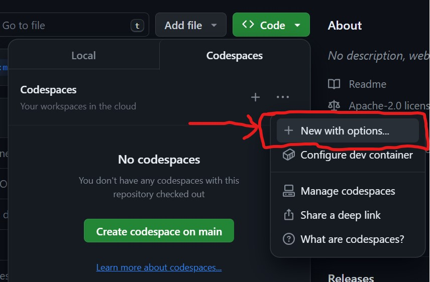
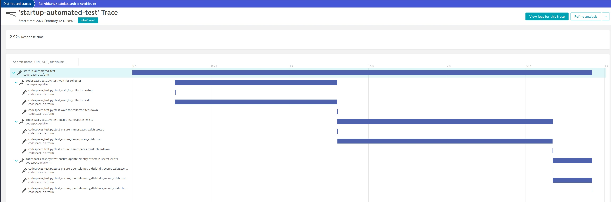

# mclass

## Prerequisites

### Create SaaS trial tenant

If you don't already have a Dynatrace SaaS tenant, sign up for a free trial here: [free 15 day Dynatrace trial](https://www.dynatrace.com/trial)

Make a note of the Dynatrace environment name. This the the first part of the URL. `abc12345` would be the environment ID for `https://abc12345.apps.dynatrace.com`

* For those running in other environments (such as `sprint`), make a note of your environment: `dev`, `sprint` or `live`

### Create DT oAuth Client

> The following link will provide some oAuth permissions. To these, please **also** include the following
> - `document:documents:write`
> - `document:documents:read`

Follow [the documentation](https://www.dynatrace.com/support/help/platform-modules/business-analytics/ba-api-ingest) to set up an OAuth client + policy + bind to your service user account email.

This is required so that the codespace can create documents (notebooks + dashboards) in Dynatrace and the platform can send business events (aka bizevents) and to Dynatrace.

You should now have 4 pieces of information:

1. A DT environment ID
1. An oAuth client ID
1. An oAuth client secret
1. An account URN

### Create DT API Token

Create a Dynatrace access token with the following permissions. This token will be used by the setup script to automatically create all other required DT tokens.

1. apiTokens.read
1. apiTokens.write

You should now have 5 pieces of information:

1. A DT environment ID
1. An oAuth client ID
1. An oAuth client secret
1. An account URN
1. An API token

### Create a GitHub Organization

[Create a free GitHub organization](https://github.com/account/organizations/new?plan=free)

> Do not skip this step! The demo **will not work without an organization**. It will not work under your user account.

#### Why won't it work?

Currently, the [ArgoCD SCM Provider Generator for GitHub](https://argocd-applicationset.readthedocs.io/en/stable/Generators-SCM-Provider/#github) only supports syncing from organizations, not user accounts.

### Fork Repo

For this repo into your new organisation.

### Create GitHub Personal Access Token

Go [here](https://github.com/settings/personal-access-tokens/new) and create a new "fine grained" token:

- Resource owner: `YourOrg/YourForkedRepo`
- Choose `Only selected repositories` and again select your fork

#### Permissions required

##### Repository Permisions

- Administration (read + write)
- Codespaces (read + write)
- Contents (read and write)

## Setup Instructions

### Create Codespace Secrets

At this point you should have seven pieces of information.

In your fork, click the green `Code` button, change to `Codespaces`. Click the `...` and choose `New with options...`

Fill in the form and launch the codespace.



The codespace will launch in a new browser window.

Wait until the `Running postStartCommand...` disappears. It should take ~10 minutes.

## Usage Instructions

Get ArgoCD password:
```
ARGOCDPWD=$(kubectl -n argocd get secret argocd-initial-admin-secret -o jsonpath="{.data.password}" | base64 -d)
echo $ARGOCDPWD
```

Change to `Ports` tab and open ArgoCD (port `30100`) & log in.

Backstage is also available (port `30105`).

### Create An Application

In backstage (port `30105`), navigate to "Create" and use the "Create a New Application" template.

The new repo will be templated into your GitHub org with the following naming scheme: `YourOrg/simplenodeservice-team01-preprod`

When Argo picks up the app, it will become available on port `80` and you must manually append (in the browser bar) the path `/simplenodeservice-{teamName}-{environment}` like so:

For example: `https://verbose-doodle-6vwwx955567f4qj9-80.app.github.dev/simplenodeservice-team01-preprod`

## Observability of the Codespace

### Self-Test OpenTelemetry traces on startup

The codespace self-tests on startup so look for a trace showing the end-to-end health:

```
https://abc12345.sprint.apps.dynatracelabs.com/ui/apps/dynatrace.classic.distributed.traces/ui/diagnostictools/purepaths?gtf=-30m&gf=all&servicefilter=0%1E50%11codespace-platform%1067%11startup-automated-test
```
1. Open the `Distributed Traces` screen
2. Filter for `Service Name ~ codespace-platform`
3. Filter for `Span name (ingested spans only) ~ startup-automated-test`



### Logs

If something goes wrong setting up the codespace, logs are sent directly to the Dynatrace SaaS ingest endpoint so `fetch logs` to see what went wrong.

## Cleanup / Destroy Resources

1. TODO: Need a script to delete DT tokens
2. Go to https://github.com/codespaces and delete the codespace
3. Go to https://github.com/yourOrg > settings and delete the organization

# Debugging

## View Creation Log

```
tail -f /workspaces/.codespaces/.persistedshare/creation.log
```
